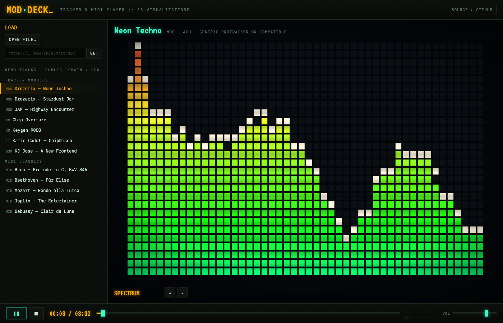

# MOD·DECK

A single-page tracker-module and MIDI player with 13 real-time audio visualizations,
styled as a CRT demoscene deck.

**Live: <https://ulasb.github.io/ModPlayer/>**



## Features

- **Tracker playback** — MOD / XM / S3M / IT (and every other format libopenmpt speaks),
  rendered by [libopenmpt](https://lib.openmpt.org/libopenmpt/) compiled to WebAssembly,
  running in an AudioWorklet (via [chiptune3](https://github.com/DrSnuggles/chiptune)).
- **MIDI playback** — .mid / .rmi / .kar synthesized in the browser by
  [SpessaSynth](https://github.com/spessasus/spessasynth_lib) with the GeneralUser GS
  SoundFont (lazy-loaded on first MIDI play).
- **Three ways to load music** — bundled public-domain demo tracks, a local file
  (picker or drag-and-drop anywhere), or a direct URL (needs CORS on the remote host).
- **13 visualizations**, all fed from one shared `AnalyserNode` pipeline
  (frequency, waveform, stereo channels, beat detection):

  | | | |
  |---|---|---|
  | SPECTRUM — LED segment analyzer | MILKDROP — [Butterchurn](https://github.com/jberg/butterchurn) (Milkdrop 2, WebGL, auto-rotating presets) | HORIZON — synthwave spectrum mountains |
  | SCOPE — triggered phosphor oscilloscope | RADIAL — rotating circular spectrum | TUNNEL — fly-through spectrum rings |
  | PLASMA — demoscene plasma, bass-driven | PARTICLES — fountain + beat bursts | KALEIDO — 8-way mirrored kaleidoscope |
  | WARP — audio-throttled starfield | NEBULA — layered polar waveform flower | WATERFALL — scrolling spectrogram |
  | PHASE XY — stereo goniometer | | |

- **Transport** — play/pause/stop, seeking, volume, VU meter, track metadata
  (format, channels, tracker).
- **Keyboard** — `space` play/pause, `←`/`→` switch visualization, `P` next Milkdrop preset.

## Development

```sh
npm install
npm run dev       # local dev server
npm run build     # typecheck + production build into dist/
npm run preview   # serve the production build
```

Deployment is automatic: every push to `main` builds and publishes to GitHub Pages
via `.github/workflows/deploy.yml`.

## Architecture

```
src/
  audio/engine.ts     WebAudio graph + per-frame analysis (FFT, RMS, bands, beats)
  audio/player.ts     unified transport facade over the two backends
  vendor/chiptune3.ts TS adaptation of the chiptune3 player (MIT)
  viz/manager.ts      render loop + visualizer lifecycle
  viz/*.ts            one file per visualization
public/
  lib/                AudioWorklet modules (libopenmpt, SpessaSynth) served unbundled
  soundfont/gm.sf3    GeneralUser GS (SF3)
  demo/               public-domain demo tracks + manifest
```

Both players route into a master `GainNode`, which feeds an `AnalyserNode` chain
(combined + per-channel). Visualizers only read the shared analysis arrays — they
never touch WebAudio, so switching them is instant and side-effect free.

## Licenses

Code is MIT. Bundled components and demo tracks are under their own (permissive /
public-domain) licenses — see [ATTRIBUTION.md](ATTRIBUTION.md).
